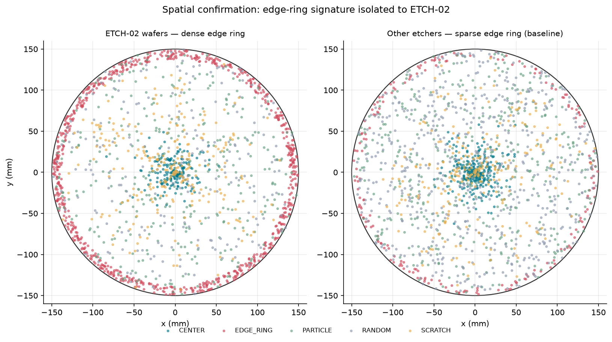
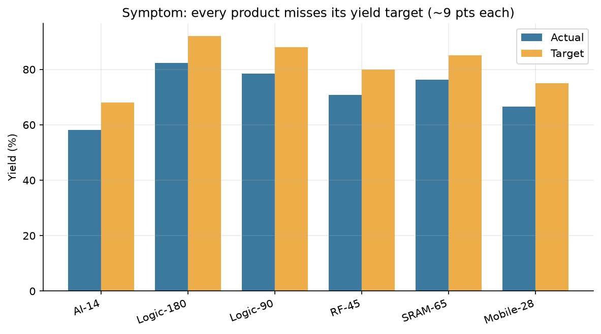
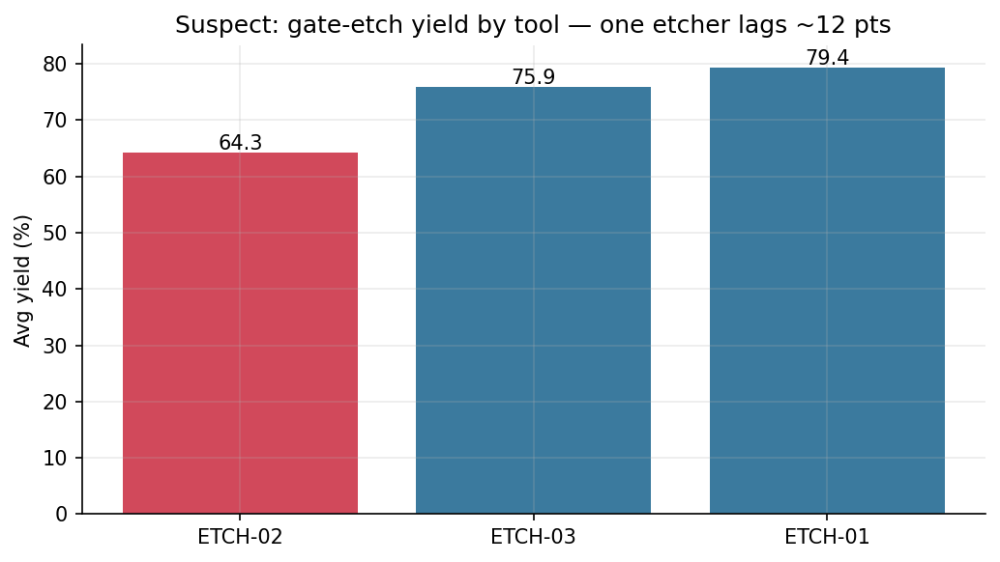
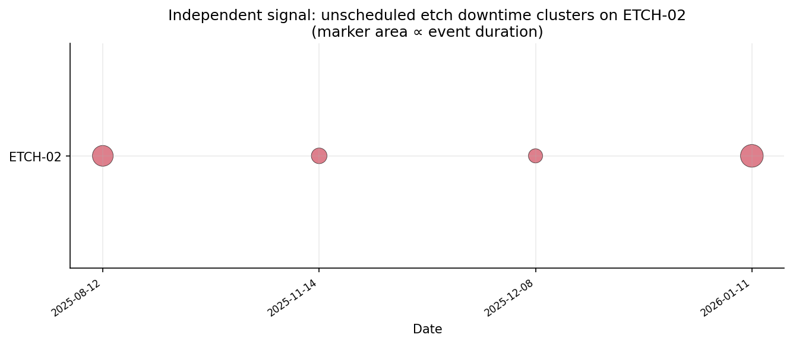
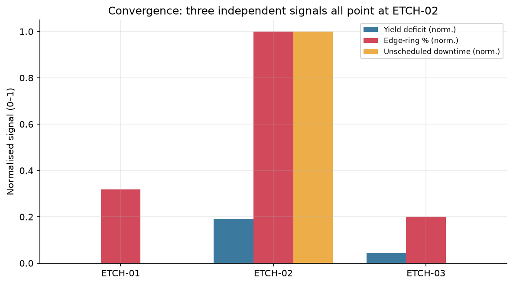
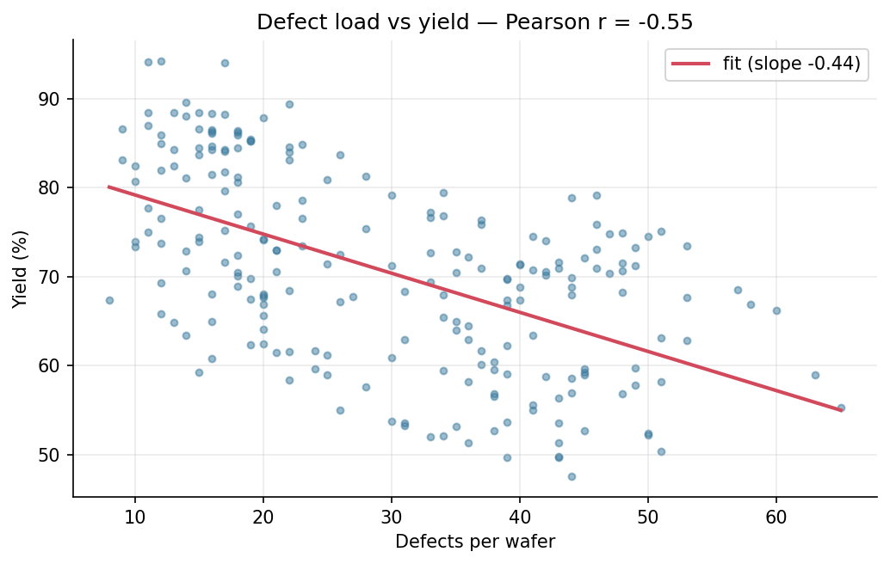

# Fab Operations Analytics

**An end-to-end semiconductor fab operations-intelligence project in SQL + Python — integrating yield, defect, tool, and maintenance data, and culminating in a root-cause investigation that traces a fab-wide yield miss to a single marginal etch chamber.**

> **The finding, in one line:** all six products miss their yield target by ~9 points. Splitting yield by the tool each wafer saw at gate etch, then confirming with two independent signals (defect spatial-signature + equipment downtime), isolates the cause to **ETCH-02** — 64.3% yield vs 79.4% for the best etcher, **3× the edge-ring defect rate**, and **all** of the fab's unscheduled etch downtime.



> ⚠️ **All data is synthetic** (generated with `seed=42`). The dataset is deliberately seeded with *one* discoverable root cause. No number in this repo is a real-world benchmark — the value on display is the **investigation method, SQL, and engineering judgement**, not the figures.
>
> **This is a demonstration RCA, not a discovery engine.** The pipeline narrates and verifies the planted cause — the suspect is a documented constant (`fabops.config.DEMO_SUSPECT_TOOL`), not a computed result. The forensic audit of exactly how the conclusion is reached, and the plan to evolve this into a genuine detection → diagnosis system, live in [`docs/`](docs/).

---

## Why this project

A yield/process/data interview in this industry is really testing one thing: *can you drive an investigation?* Not "can you write a `JOIN`," but **symptom → suspect → confirm → quantify → act**. This repo demonstrates that arc on a realistic MES-style schema, with the SQL logic built as a documented view layer (the way an analytics engineer actually ships it) and the conclusion rendered as charts a shift lead could read.

## The investigation (8 steps)

The full narrative — with code, tables, and inline charts — lives in
**[`notebooks/investigation.ipynb`](notebooks/investigation.ipynb)** and reproduces exactly via `python -m fabops.investigation`.

**1 · Symptom — every product misses target by ~9 pts.** Uniform loss across the catalogue argues against a product cause and points at shared infrastructure.



**2 · Suspect — split gate-etch yield by tool.** One etcher lags the others by ~12 points on the same step.



**3 · Confirmation #1 — defect signature.** ETCH-02's defects are ~3× more *edge-ring* — the classic fingerprint of an etch-chamber uniformity fault — and they sit physically at the **wafer edge** (mean defect radius 107 mm vs 85 mm; 62% in the edge zone vs 39%). See the wafer maps at the top of this README.

**4 · Confirmation #2 — an independent root signal.** The maintenance log shows ETCH-02 carries **all** unscheduled etch downtime (30.5 h across 4 events); the other etchers have none. Two independent data sources name the same tool.



**5 · Convergence — one scorecard, three signals.** Worst yield, highest edge-ring %, highest downtime — all the same tool.



**6 · Size the impact.** ~117 yield-tested wafers ran through ETCH-02; matching them to the good etchers would have recovered a large block of good die (synthetic-data estimate). Across the whole fab, defect load anti-correlates with yield at **Pearson r = −0.55**.



**7 · Exposure.** Rank lots by their dependence on ETCH-02 so containment (re-inspection, rerouting) can be prioritised.

**8 · Recommendation.** Take ETCH-02 offline for chamber inspection; re-inspect high-exposure lots and reroute gate-etch to ETCH-01/03 until re-qualified; add a per-chamber SPC rule on edge-ring fraction so the next drift trips an alarm, not a post-mortem.

## Quickstart

```bash
# 1. install (editable package + dashboard/notebook/test extras)
pip install -e ".[app,notebook,dev]"

# 2. build the database (generates data/fab.db, the star model, and the views)
python -m fabops.build_db          # or: fabops-build

# 3. run the full investigation (prints the story + regenerates all charts)
python -m fabops.investigation     # or: fabops-investigate
```

This is the **demonstration**: it narrates a known, planted conclusion on the
legacy database. The answer-blind engine, which is handed a schema v2 dataset
and told nothing, is separate:

```bash
fabops-diagnose path/to/fab.db     # prints a fabops.investigation/v1 report
```

It reads one schema v2 database, is told nothing else, and may answer
*insufficient evidence* — which on a fault-free dataset is the only correct
answer. What it can and cannot do is measured in `docs/design/DIAGNOSIS_CONTRACT.md`;
no number it produces is a capability claim yet.

Back to the demonstration pipeline:

```bash
# 4. launch the interactive dashboard
streamlit run app/ops_dashboard.py

# 5. run the test suite
pytest -q
```

Or just use the `Makefile`: `make install`, `make setup`, `make investigate`, `make app`, `make test`.

## What's in the box

```
fab-operations-analytics/
├── README.md                       # you are here
├── pyproject.toml                  # packaging (src layout) + console scripts + deps
├── requirements.txt                # convenience: installs -e .[app,notebook,dev]
├── Makefile                        # install / setup / investigate / app / test / charts / notebook
├── data/
│   ├── generate_fab_db.py          # deterministic synthetic-data generator (seed=42)
│   ├── fab.db                      # built SQLite database (regenerable)
│   └── fab_database.sql            # portable schema + INSERTs
├── sql/
│   ├── star_model.sql              # fact_yield star table for fast BI aggregation
│   ├── views.sql                   # the analytical views (the logic lives here)
│   └── rca_queries.sql             # the investigation as a documented query library
├── src/fabops/                     # reads the observable plane, and only that
│   ├── db.py                       # data-access layer (SQL → pandas)
│   ├── build_db.py                 # one command to stand up the DB + views
│   ├── charts.py                   # every figure, rendered with matplotlib
│   ├── investigation.py            # the LEGACY narrated demo (conclusion is a constant)
│   └── diagnosis/                  # the answer-blind engine: diagnose(db_path)
├── src/fabsim/                     # the simulator: builds the fab, writes both planes
│   ├── world.py timeline.py latent.py response.py observation.py
│   ├── defects.py die.py           # the causal chain, mechanism → … → yield
│   ├── mechanisms/                 # what a fault physically does
│   └── emit/                       # observable dataset + hidden truth + manifest
├── src/fabeval/                    # the evaluator: the ONE place both planes may join
│   ├── queries.py                  # reference analytical queries (observable only)
│   ├── leakage.py acceptance.py    # L1–L11 and A1–A11, as machine checks
│   └── matrix.py diagnosisscore.py # the benchmark, and report-vs-answer-key scoring
├── scenarios/                      # scenario configs + world template (fabsim reads these)
├── notebooks/
│   └── investigation.ipynb         # the narrative version (executed, with outputs)
├── app/
│   └── ops_dashboard.py            # Streamlit dashboard (Overview / Yield / RCA / Maps)
├── tests/
│   ├── test_queries.py             # legacy: schema integrity + the RCA findings hold
│   └── fabsim/ fabops/ fabeval/    # the generation, engine and evaluation planes
├── docs/                           # audit, design contracts, architecture decisions, roadmap
└── reports/figures/                # generated charts (embedded above)
```

**Two systems live here, and the separation is the point.** The legacy pipeline
above (`data/`, `sql/`, `src/fabops/{db,charts,investigation}.py`, the notebook,
the dashboard) narrates a *planted* conclusion on a schema v1 database. Alongside
it, `fabsim` generates synthetic fabs whose faults are physics-mediated and whose
answer key is a physically separate file, `fabops.diagnosis` investigates one of
those datasets knowing nothing but a database path, and `fabeval` is the only
component permitted to hold both the answer and the report at once. The rules
that keep those planes apart — and the checks that enforce them — are in
[`docs/design/`](docs/design/); the decisions behind them are in
[`docs/ARCHITECTURE_DECISIONS.md`](docs/ARCHITECTURE_DECISIONS.md).

## Design notes

- **Logic lives in SQL views, not in app code.** `views.sql` defines 13 named, testable views; the dashboard and notebook stay thin (`SELECT * FROM v_…`). Gate etch — the step every analysis pivots on — is defined exactly once (`v_gate_etch_runs`, resolved by step *name*, not a magic id). This is how a real BI/analytics layer is structured.
- **A star model for the BI layer.** `fact_yield` pre-joins each wafer to its lot/product/gate-etch-tool dimensions so aggregations are one-liners.
- **Data-calibrated defect zoning.** On this 300 mm wafer, EDGE_RING defects sit at a mean radius of ~143 mm and CENTER at ~18 mm, so the center/mid/edge cut-offs (50 mm / 110 mm) cleanly separate the spatial classes — which is what makes the wafer-map showpiece read.
- **Tests assert the *story*, not just that queries run.** `test_queries.py` checks that ETCH-02 is the worst etcher on every signal, that edge-ring defects are radially at the edge, and that defect load anti-correlates with yield.

## Tech

Python · SQLite · pandas · matplotlib · Streamlit · pytest. No external services; everything runs locally from a single generated database.

## Résumé bullets (honest — describes work actually done here)

- Built an end-to-end fab-operations analytics project (SQL + Python) over a synthetic 300-wafer MES-style dataset, integrating yield, defect, tool, and maintenance data behind a 13-view analytical layer and a `fact_yield` star model.
- Implemented a documented root-cause investigation that traced a uniform ~9-point yield miss to a single marginal etch chamber via three converging signals — gate-etch yield (64% vs 79%), edge-ring defect fraction (3×), and unscheduled downtime — and confirmed the fault spatially from defect x/y coordinates.
- Quantified defect-load-to-yield correlation (Pearson r = −0.55) and lot-level exposure for containment; shipped an interactive Streamlit dashboard and a 27-test pytest suite that guards both schema integrity and the analytical findings.

---

*Synthetic data, fully reproducible (`seed=42`). Honesty over hype: this is a methodology and SQL demonstration on fabricated data, not a record of real fab impact.*
